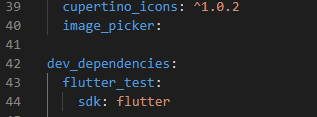
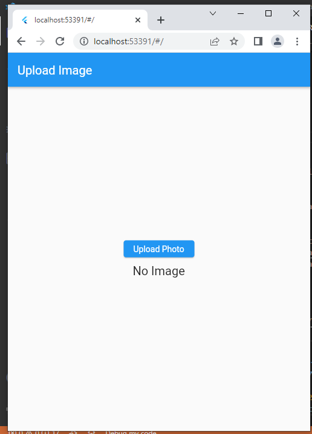
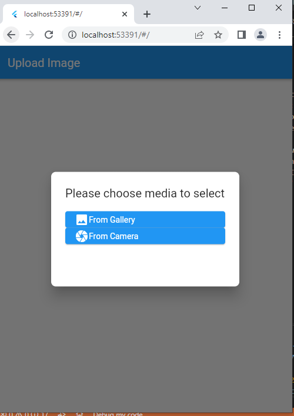
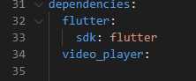
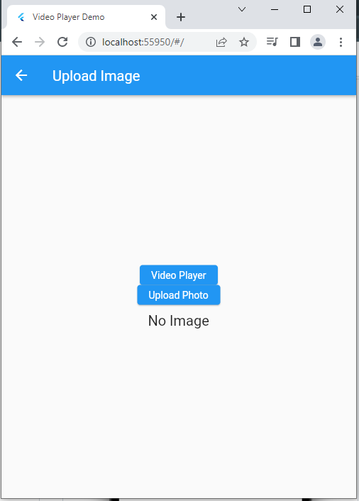
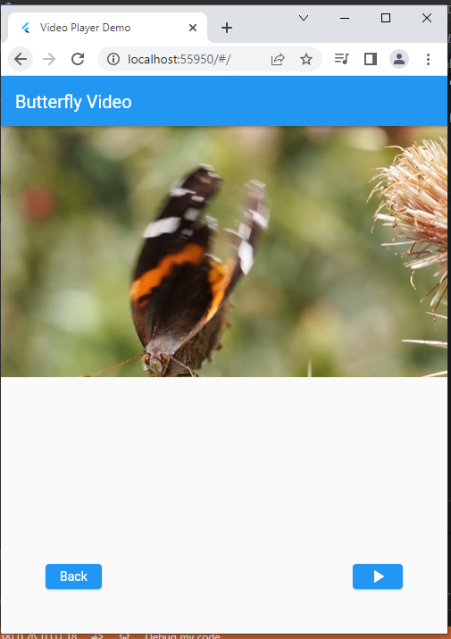

# flutter_localstorage_and_videoplayer

## Hasil Praktikum

### 1. File Upload

• Import library *image_picker* pada *pubspec.yaml*



• Membuat class *mainuploadfile.dart*

```
import 'dart:io';
import 'package:flutter/material.dart';
import 'package:image_picker/image_picker.dart';

void main() => runApp(MaterialApp(
      home: Home(),
      debugShowCheckedModeBanner: false,
    ));

class Home extends StatefulWidget {
  @override
  _HomeState createState() => _HomeState();
}

class _HomeState extends State<Home> {

  XFile? image;

  final ImagePicker picker = ImagePicker();

  Future getImage(ImageSource media) async {
    var img = await picker.pickImage(source: media);

    setState(() {
      image = img;
    });
  }

  void myAlert() {
    showDialog(
        context: context,
        builder: (BuildContext context) {
          return AlertDialog(
            shape:
                RoundedRectangleBorder(borderRadius: BorderRadius.circular(8)),
            title: Text('Please choose media to select'),
            content: Container(
              height: MediaQuery.of(context).size.height / 6,
              child: Column(
                children: [
                  ElevatedButton(
                    onPressed: () {
                      Navigator.pop(context);
                      getImage(ImageSource.gallery);
                    },
                    child: Row(
                      children: [
                        Icon(Icons.image),
                        Text('From Gallery'),
                      ],
                    ),
                  ),
                  ElevatedButton(
                    onPressed: () {
                      Navigator.pop(context);
                      getImage(ImageSource.camera);
                    },
                    child: Row(
                      children: [
                        Icon(Icons.camera),
                        Text('From Camera'),
                      ],
                    ),
                  ),
                ],
              ),
            ),
          );
        });
  }
````
| Menekan Button Upload Foto | Memilih Media Upload|
|-|-|
|||

### 2. Video Player Plugin 

• Tambahkan dependency video_player



• Tambahkan permission untuk melakukan pemutaran video dari internet

• Membuat folder *src* didalam folder *lib* dengan nama file *mainvideoplayer.dart* 

````
import 'dart:async';

import 'package:flutter/material.dart';
import 'package:flutter_localstorage_and_videoplayer/main.dart';
import 'package:video_player/video_player.dart';

class VideoPlayerApp extends StatelessWidget {
  const VideoPlayerApp({super.key});

  @override
  Widget build(BuildContext context) {
    return const MaterialApp(
      debugShowCheckedModeBanner: false,
      title: 'Video Player Demo',
      home: VideoPlayerScreen(),
    );
  }
}

class VideoPlayerScreen extends StatefulWidget {
  const VideoPlayerScreen({super.key});

  @override
  State<VideoPlayerScreen> createState() => _VideoPlayerScreenState();
}

class _VideoPlayerScreenState extends State<VideoPlayerScreen> {
  late VideoPlayerController _controller;
  late Future<void> _initializeVideoPlayerFuture;

  @override
  void initState() {
    super.initState();

    // Create and store the VideoPlayerController. The VideoPlayerController
    // offers several different constructors to play videos from assets, files,
    // or the internet.
    _controller = VideoPlayerController.network(
      'https://flutter.github.io/assets-for-api-docs/assets/videos/butterfly.mp4',
    );

    // Initialize the controller and store the Future for later use.
    _initializeVideoPlayerFuture = _controller.initialize();

    // Use the controller to loop the video.
    _controller.setLooping(true);
  }

   @override
  void dispose() {
    // Ensure disposing of the VideoPlayerController to free up resources.
    _controller.dispose();

    super.dispose();
  }

  @override
  Widget build(BuildContext context) {
    return Scaffold(
      appBar: AppBar(
        title: const Text('Butterfly Video'),
      ),
      // Use a FutureBuilder to display a loading spinner while waiting for the
      // VideoPlayerController to finish initializing.
      body: FutureBuilder(
        future: _initializeVideoPlayerFuture,
        builder: (context, snapshot) {
          if (snapshot.connectionState == ConnectionState.done) {
            // If the VideoPlayerController has finished initialization, use
            // the data it provides to limit the aspect ratio of the video.
            return AspectRatio(
              aspectRatio: _controller.value.aspectRatio,
              // Use the VideoPlayer widget to display the video.
              child: VideoPlayer(_controller),
            );
          } else {
            // If the VideoPlayerController is still initializing, show a
            // loading spinner.
            return const Center(
              child: CircularProgressIndicator(),
            );
          }
        },
      ),
      bottomSheet: Padding(
        padding: EdgeInsets.all(50),
        child: Row(
          mainAxisAlignment: MainAxisAlignment.spaceBetween,
          children: [
            ElevatedButton(
              onPressed: () {
                Navigator.push(
                  context,
                  MaterialPageRoute(builder: (context) => Home()),
                );
              },
              child: Text('Back'),
            ),
            ElevatedButton(
              onPressed: () {
                // Wrap the play or pause in a call to `setState`. This ensures the
                // correct icon is shown.
                setState(() {
                  // If the video is playing, pause it.
                  if (_controller.value.isPlaying) {
                    _controller.pause();
                  } else {
                    // If the video is paused, play it.
                    _controller.play();
                  }
                });
              },
              // Display the correct icon depending on the state of the player.
              child: Icon(
                _controller.value.isPlaying ? Icons.pause : Icons.play_arrow,
              ),
            ),
          ],
        ),
      ),
    );
  }
}
````

| Menekan Button Upload Foto | Memilih Media Upload|
|-|-|
|||
